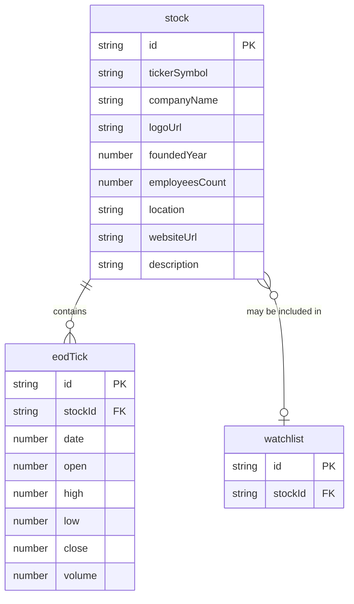

# AssetMate

AssetMate is a single page application to display company information including stock price data. It's using a mock backend. Because of that, the prices might not be up-to-date. The focus is to design a responsive frontend with a mobile first approach.

## Additional Information

### Data Model

### Tools Used

[Figma](https://www.figma.com/)\
[Visual Studio Code](https://code.visualstudio.com/)\
[Adobe Photoshop](https://www.adobe.com/products/photoshop.html)

### Resources Used

[MDN Web Docs](https://developer.mozilla.org/en-US/)\
[W3Schools](https://www.w3schools.com/)\
[StackOverflow](https://stackoverflow.com/)