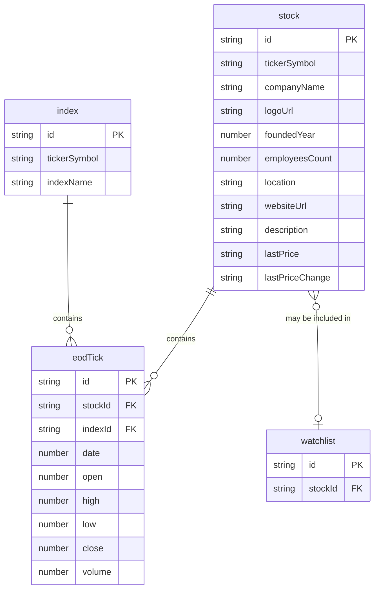

# AssetMate

Asset Mate is a single-page application for displaying company information, including stock price data.

The application uses a mock backend, so stock prices may not always be up to date. The main focus of the project is building a responsive frontend with a mobile-first approach.

## Additional Information

### Data Model

### Tools Used

[Figma](https://www.figma.com/)\
[Visual Studio Code](https://code.visualstudio.com/)\
[Adobe Photoshop](https://www.adobe.com/products/photoshop.html)\
[ChatGPT 5.6-Sol](https://chatgpt.com/)

### Resources Used

[MDN Web Docs](https://developer.mozilla.org/en-US/)\
[W3Schools](https://www.w3schools.com/)\
[StackOverflow](https://stackoverflow.com/)\
[Material UI](https://mui.com/material-ui/)\
[Roboto Font](https://fonts.google.com/specimen/Roboto)\
[Vite](https://vite.dev/)\
[React](https://react.dev/)\
[React Router](https://reactrouter.com/)
